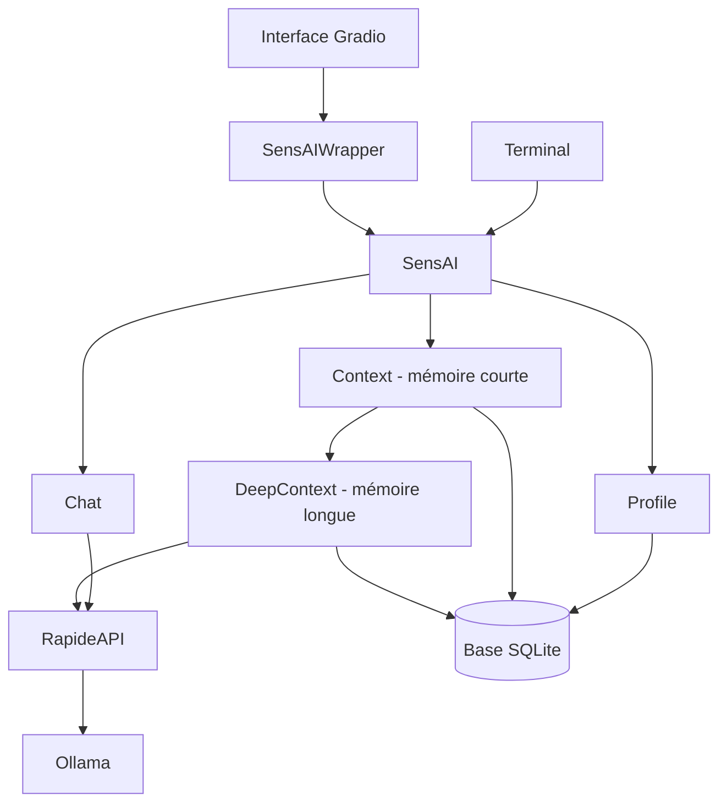
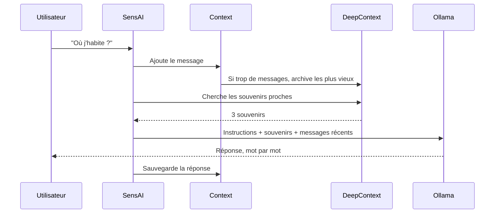

# 🏗️ 2. Architecture

Cette page montre comment le projet est **organisé**.

[⬅️ Retour au sommaire](README.md)

---

## 🧩 Les 4 grandes parties

| Partie | Dossier | Rôle |
|--------|---------|------|
| 🎮 **SensAI** | `src/main.py` | Le chef d'orchestre. Il relie tout. |
| 🎁 **Wrapper** | `src/galerelm/wrapper.py` | Des fonctions simples pour l'interface Gradio. |
| 🗃️ **galerelm** | `src/galerelm/models/` | Les données : profils, messages, mémoire. |
| 🌐 **rapideAPI** | `src/rapideAPI/` | Le client qui parle à Ollama. |

---

## 🔗 Qui parle à qui



À retenir :

- L'interface **ne touche jamais** directement la base.
- Elle passe toujours par le **Wrapper**.
- Seul **RapideAPI** parle à Ollama.

---

## 📁 Les fichiers importants

```
SensAI/
├── .env                 → Réglages (modèle, adresse)
├── setup.sh             → Installation
├── backend.sh           → Lancement d'Ollama
├── docs/                → Cette documentation
└── src/
    ├── main.py          → Classe SensAI + terminal
    ├── wrapper.md       → Liste des fonctions du wrapper
    ├── galerelm/
    │   ├── wrapper.py   → Classe SensAIWrapper
    │   └── models/
    │       ├── base.py          → Base commune SQLAlchemy
    │       ├── profile.py       → Utilisateur
    │       ├── context.py       → Mémoire courte
    │       ├── deep_context.py  → Mémoire longue
    │       ├── message.py       → Message
    │       ├── chat.py          → Requête vers l'IA
    │       ├── options.py       → Réglages de l'IA
    │       ├── response.py      → Réponse de l'IA
    │       ├── tools.py         → Outils (fonctions)
    │       └── dto.py           → Objets de réponse du wrapper
    ├── rapideAPI/
    │   └── client.py    → Client HTTP
    ├── webapp/          → Ancienne interface Gradio
    └── model/           → Ancien prototype (non relié)
```

---

## 🔄 Le trajet d'un message

Voici ce qui se passe quand vous envoyez un message.



En étapes :

1. Le message est **sauvegardé** dans la mémoire courte.
2. Si la mémoire courte est **pleine**, les plus vieux messages partent en mémoire longue.
3. SensAI **cherche** dans la mémoire longue les souvenirs liés à la question.
4. SensAI **ajoute** ces souvenirs aux instructions.
5. Tout est **envoyé** à Ollama.
6. La réponse **s'affiche** mot par mot.
7. La réponse est **sauvegardée**.

---

## 🧱 Les choix techniques

| Choix | Pourquoi |
|-------|----------|
| **SQLite** | Un seul fichier. Rien à installer. |
| **SQLAlchemy** | Manipuler la base avec des classes Python. |
| **Ollama** | Faire tourner l'IA en local, sans cloud. |
| **Streaming** | Afficher la réponse pendant qu'elle s'écrit. |
| **Calcul de similarité en Python pur** | Pas besoin de `numpy`. |
| **`Chat` n'est pas sauvegardé** | C'est un objet jetable. On ne garde que les messages. |

---

[⬅️ Page précédente : Démarrage](01-demarrage.md) · [➡️ Page suivante : Mémoire](03-memoire.md)
