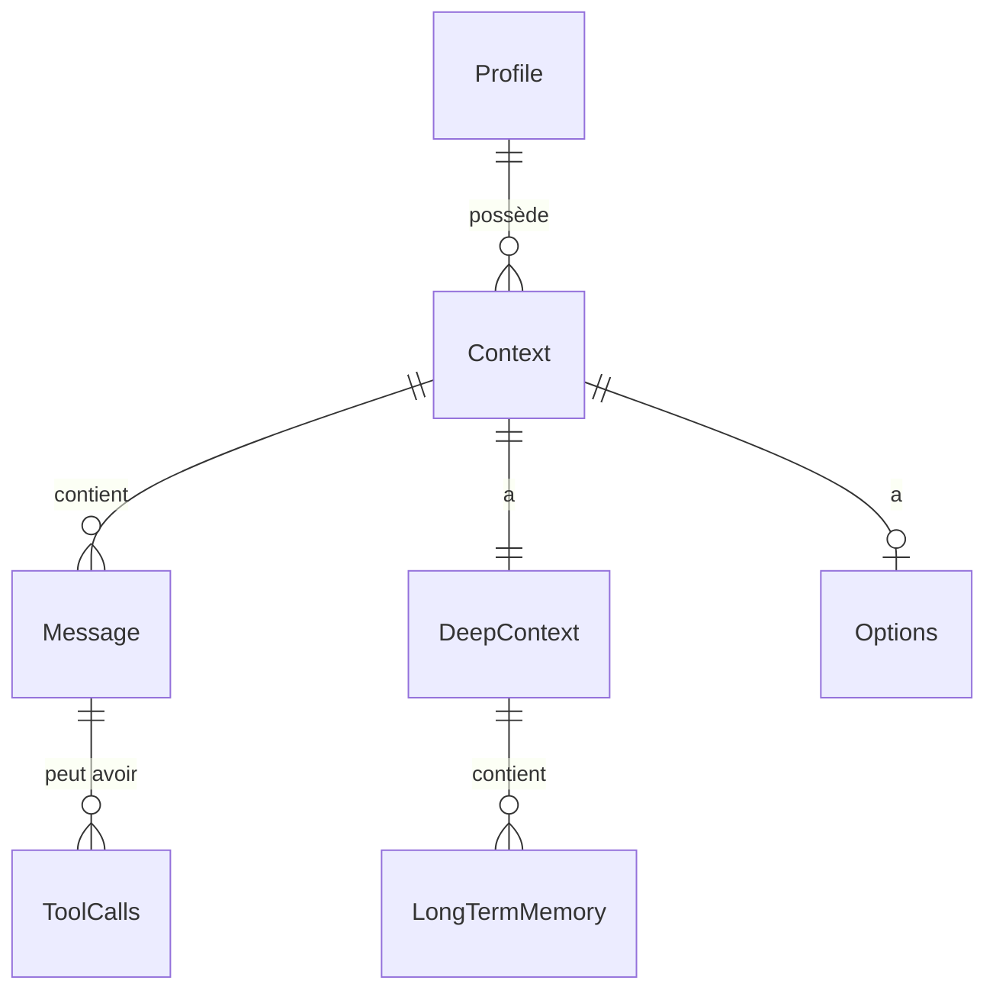

# 🗃️ 4. Les modèles de données

Cette page décrit **chaque classe** du dossier `src/galerelm/models/`.

[⬅️ Retour au sommaire](README.md)

---

## 🧭 Vue d'ensemble

Lecture :

- Un **profil** peut avoir **plusieurs** conversations.
- Une **conversation** a **une** mémoire longue.
- Une **mémoire longue** a **plusieurs** souvenirs.

---

## 🧑 `Profile`

Fichier : `profile.py`

Un utilisateur.

| Champ | Type | Rôle |
|-------|------|------|
| `id` | texte | Identifiant unique (UUID) |
| `name` | texte | Nom affiché |
| `email` | texte | Unique. Sert à retrouver le profil. |
| `password` | texte | Pas encore utilisé (toujours vide) |
| `instructions` | texte | Les consignes données à l'IA |

> [!NOTE]
> Le champ `instructions` devient le **prompt système**.
> Changer les instructions change le comportement de l'IA.

---

## 🟢 `Context`

Fichier : `context.py`

Une conversation. C'est la **mémoire courte**.

| Champ | Rôle |
|-------|------|
| `profile_id` | À qui appartient la conversation |
| `context_limit` | Nombre max de messages (10 par défaut) |
| `messages` | La liste des messages |
| `deep_context` | La mémoire longue liée |
| `options` | Les réglages de l'IA |

| Méthode | Rôle |
|---------|------|
| `add(message, api_client)` | Ajoute un message. Archive si trop plein. |
| `get_messages_copy()` | Donne une **copie** des messages. |

> [!IMPORTANT]
> Utilisez toujours `get_messages_copy()` avant de créer un `Chat`.
> Sinon, SQLAlchemy peut **déplacer** les messages et les perdre.

Détails : [context.md](../src/galerelm/models/context.md)

---

## 🔵 `DeepContext` et `LongTermMemory`

Fichier : `deep_context.py`

La **mémoire longue**.

`DeepContext` :

| Champ / Méthode | Rôle |
|-----------------|------|
| `embed_model` | Modèle de vectorisation (`nomic-embed-text`) |
| `memories` | La liste des souvenirs |
| `save(messages, api_client)` | Archive et vectorise des messages |
| `search(query, api_client, top_k)` | Trouve les souvenirs les plus proches |

`LongTermMemory` (un souvenir) :

| Champ | Rôle |
|-------|------|
| `role` | `user` ou `assistant` |
| `content` | Le texte |
| `embedding` | Le vecteur (liste de nombres) |

Détails : [deep_context.md](../src/galerelm/models/deep_context.md)

---

## ✉️ `Message` et `MessageList`

Fichier : `message.py`

Un message de la conversation.

| Champ | Rôle |
|-------|------|
| `role` | `system`, `user`, `assistant` ou `tool` |
| `content` | Le texte |
| `images` | Images en base64 (optionnel) |
| `tool_calls` | Appels d'outils (optionnel) |
| `thinking` | Réflexion du modèle. **Jamais envoyée** à Ollama. |

`MessageList` est une liste qui ne contient que des `Message`.

> [!WARNING]
> Ne jamais envoyer `thinking` à Ollama. Cela provoque une erreur 500.

---

## 💬 `Chat`

Fichier : `chat.py`

La **requête** envoyée à l'IA.

- Ce n'est **pas** une table de la base.
- C'est un objet **jetable** : créé, utilisé, oublié.

| Méthode | Rôle |
|---------|------|
| `format()` | Construit le JSON envoyé à Ollama |
| `execute_stream()` | Envoie et renvoie la réponse **mot par mot** |
| `ask(texte)` | Raccourci : envoie, affiche, garde la réponse |

Après `execute_stream()`, la réponse complète est dans `last_response`.

> [!IMPORTANT]
> Le prompt système est **toujours** placé en **première** position.
> Les modèles Qwen l'exigent.

Détails : [chat.md](../src/galerelm/models/chat.md)

---

## ⚙️ `Options`

Fichier : `options.py`

Les réglages de l'IA.

| Réglage | Défaut | Effet |
|---------|--------|-------|
| `temperature` | 0.7 | Plus haut = plus créatif |
| `top_k` | 40 | Nombre de mots candidats |
| `top_p` | 0.9 | Filtre les mots peu probables |
| `min_p` | 0.05 | Probabilité minimum d'un mot |
| `seed` | 0 | Graine du hasard |
| `num_ctx` | 4096 | Taille de la fenêtre de lecture |
| `num_predict` | 512 | Longueur max de la réponse |
| `stop` | `["\nuser:", "</s>"]` | Mots qui arrêtent la réponse |

---

## 📨 `ChatResponse`, `LogProb`, `TopLogProb`

Fichier : `response.py`

La **réponse** d'Ollama.

| Champ | Rôle |
|-------|------|
| `message` | Le message de l'IA |
| `eval_count` | Nombre de mots (tokens) générés |
| `eval_duration` | Temps de génération (en nanosecondes) |
| `done` | La réponse est-elle finie ? |

---

## 🛠️ `Tools`, `ToolsFunction`, `ToolsList`

Fichier : `tools.py`

Des **outils** que l'IA pourrait appeler.

> [!NOTE]
> Ces classes existent mais ne sont **pas encore utilisées**.

---

## 📦 `dto.py`

Les **objets de réponse** du wrapper.

Voir [Wrapper](05-wrapper.md).

---

## 🧱 `base.py`

Contient `Base`.

Toutes les classes sauvegardées héritent de `Base`.

> [!IMPORTANT]
> Une nouvelle classe sauvegardée doit être importée dans `models/__init__.py`.
> Sinon, sa table **ne sera pas créée**.

---

[⬅️ Page précédente : Mémoire](03-memoire.md) · [➡️ Page suivante : Wrapper](05-wrapper.md)
