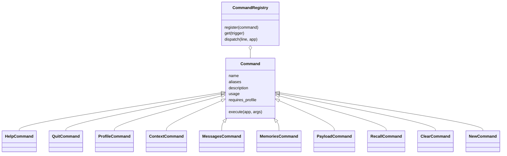

# ⌨️ 6. Le terminal

Cette page décrit l'utilisation de SensAI **dans le terminal**.

[⬅️ Retour au sommaire](README.md)

---

## ▶️ Lancer

```bash
PYTHONPATH=. .venv/bin/python src/main.py
```

---

## 🔤 Message ou commande ?

| Vous tapez | Ce qui se passe |
|------------|-----------------|
| Un texte normal | Il est envoyé à l'IA |
| Un texte qui commence par `/` | C'est une **commande**. Rien n'est envoyé à l'IA. |

---

## 📋 Les commandes

### Général

| Commande | Effet |
|----------|-------|
| `/help` | Affiche la liste des commandes |
| `/quit` | Quitte. Marche aussi avec `/exit` et `/q`. |

### Voir l'état

| Commande | Effet |
|----------|-------|
| `/profile` | Affiche le profil |
| `/context` | Affiche les chiffres de la conversation |
| `/messages` | Affiche la mémoire courte |
| `/memories` | Affiche la mémoire longue |
| `/payload` | Affiche le JSON exact envoyé à l'IA |

### Mémoire longue

| Commande | Effet |
|----------|-------|
| `/recall <texte>` | Cherche dans la mémoire longue, avec les scores |

Exemple :

```
Vous : /recall où j'habite
── Résultats RAG pour "où j'habite" (2 trouvés) ──
  1. 👤 [user] (score: 0.8123) J'habite à Paris
  2. 🤖 [assistant] (score: 0.7710) Noté, vous habitez à Paris.
```

### Repartir de zéro

| Commande | Effet |
|----------|-------|
| `/clear` | Vide la mémoire courte |
| `/new` | Crée une nouvelle conversation |

> [!NOTE]
> `/clear` et `/new` **ne suppriment pas** la mémoire longue.

---

## 🧱 Comment les commandes sont construites

Chaque commande est une **classe**.

Toutes les commandes héritent de la classe mère **`Command`**.



Les fichiers, dans `src/commands/` :

| Fichier | Contenu |
|---------|---------|
| `base.py` | La classe mère `Command` et `CommandResult` |
| `registry.py` | `CommandRegistry` : trouve et lance la bonne commande |
| `general.py` | `/help`, `/quit` |
| `debug.py` | `/profile`, `/context`, `/messages`, `/memories`, `/payload` |
| `memory.py` | `/recall` |
| `session.py` | `/clear`, `/new` |
| `__init__.py` | La liste `BUILTIN_COMMANDS` et `default_registry()` |

---

## ➕ Ajouter une commande

1. Créez une classe qui hérite de `Command` :

```python
from src.commands.base import Command, CommandResult


class BonjourCommand(Command):
    name = "bonjour"
    aliases = ("salut",)
    description = "Dit bonjour."

    def execute(self, app, args):
        print(f"Bonjour {app.profile.name} !")
        return CommandResult.CONTINUE
```

2. Ajoutez-la dans `BUILTIN_COMMANDS`, dans `src/commands/__init__.py`.

C'est tout.

À savoir :

- `description` apparaît dans `/help`.
- `usage` montre les arguments attendus. Exemple : `"<requête>"`.
- Renvoyez `CommandResult.QUIT` pour **quitter** le programme.
- Mettez `requires_profile = False` si la commande marche **sans profil**.
- Deux commandes ne peuvent pas avoir le **même** nom ou alias. Le registre refuse.
- Si une commande plante, le terminal **ne s'arrête pas**. L'erreur est affichée et enregistrée dans les logs.

Outils déjà prêts dans `Command` :

| Outil | Rôle |
|-------|------|
| `self.title("...")` | Affiche un titre |
| `self.info("...")` | Affiche une information |
| `self.success("...")` | Affiche une réussite |
| `self.error("...")` | Affiche une erreur |
| `self.preview(texte, 80)` | Coupe un texte trop long |
| `self.icon(role)` | Donne l'icône d'un rôle (👤, 🤖…) |

---

## 📜 Les logs

Les logs s'affichent dans le terminal.

Format :

```
2026-10-05 12:00:00 - galerelm.models.context - INFO - [Context] Ajout d'un message (user)
```

| Nom du log | Partie |
|------------|--------|
| `sensai` | `main.py` |
| `galerelm.models.context` | Mémoire courte |
| `galerelm.models.deep_context` | Mémoire longue |
| `galerelm.models.chat` | Requêtes vers l'IA |
| `galerelm.wrapper` | Wrapper |
| `src.rapideAPI.client` | Appels HTTP |

Pour voir plus de détails, changez `INFO` en `DEBUG` en bas de `main.py`.

---

[⬅️ Page précédente : Wrapper](05-wrapper.md) · [➡️ Page suivante : RapideAPI](07-rapideapi.md)
